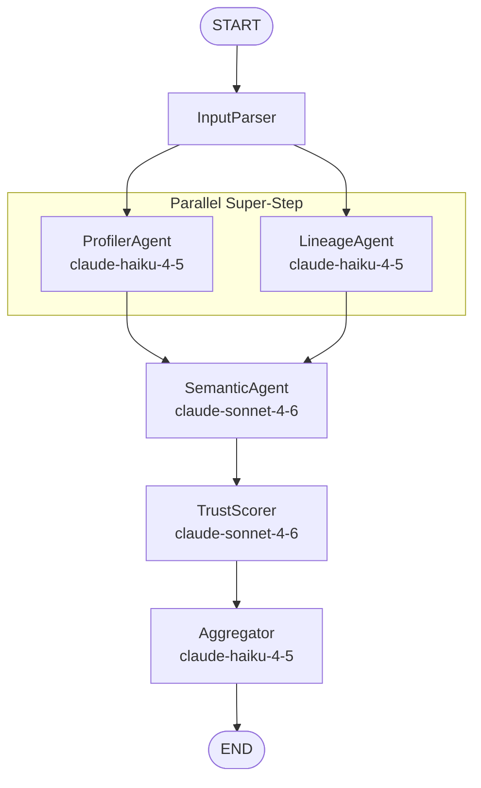

# Agentic Context Layer for Structured Data

## Project Structure

```
agentic-data-context-layer/
├── pyproject.toml
├── README.md
├── .env.example
├── .gitignore
├── samples/
│   ├── ecommerce.sql            # Sample DDL for demo/testing
│   └── ecommerce.csv            # Sample CSV schema for demo/testing
├── src/
│   └── context_layer/
│       ├── __init__.py
│       ├── models/
│       │   ├── __init__.py
│       │   ├── state.py         # LangGraph typed state (TypedDict + reducers)
│       │   ├── schema.py        # Input schema Pydantic models
│       │   └── outputs.py       # Per-agent output Pydantic models + final ContextLayer
│       ├── agents/
│       │   ├── __init__.py
│       │   ├── input_parser.py  # Parses raw DDL/CSV into structured TableSchema
│       │   ├── profiler.py      # Column types, null rates, patterns, anomalies
│       │   ├── semantic.py      # LLM-generated definitions per column/table
│       │   ├── lineage.py       # FK/dependency inference from schema structure
│       │   ├── trust_scorer.py  # Deterministic rules + LLM confidence scoring
│       │   └── aggregator.py    # Compiles all outputs into final ContextLayer
│       ├── graph.py             # StateGraph wiring with parallel fan-out/fan-in
│       ├── llm.py               # LLM client factory (haiku vs sonnet routing)
│       └── api.py               # FastAPI app with /analyze endpoint
├── templates/
│   └── report.html              # Simple Jinja2 template for HTML output
└── tests/
    ├── __init__.py
    ├── test_models.py
    └── test_graph.py
```

## Architecture: Agent Graph



**Key architectural decision:** Profiler and Lineage fan out from InputParser and fan in at Semantic. LangGraph runs them in the same super-step (true parallelism). Semantic needs both outputs — profiler data enriches definitions, lineage provides relationship context.

## 1. Pydantic Models (Strict Typed Contracts)

### Input Models (`models/schema.py`)

- `ColumnSchema`: name, data_type, nullable, is_primary_key, default_value, raw_ddl_fragment
- `TableSchema`: name, columns (list of ColumnSchema), raw_ddl

### Agent Output Models (`models/outputs.py`)

- **ProfilerOutput**
  - `ColumnProfile`: column_name, inferred_semantic_type (email/phone/currency/id/etc.), null_rate (float), distinct_ratio (float), pattern (regex if detected), anomalies (list of strings)
  - `TableProfile`: table_name, column_profiles (list), estimated_purpose (str)
  - `ProfilerOutput`: tables (list of TableProfile)

- **LineageOutput**
  - `Relationship`: source_table, source_column, target_table, target_column, relationship_type (literal: "explicit_fk" | "inferred"), confidence (float)
  - `LineageOutput`: relationships (list of Relationship), orphan_tables (list of str)

- **SemanticOutput**
  - `ColumnDefinition`: column_name, definition (str), business_context (str)
  - `TableDefinition`: table_name, definition (str), column_definitions (list), domain (str)
  - `SemanticOutput`: tables (list of TableDefinition)

- **TrustScore Model**
  - `TrustScore`: entity_type ("table" | "column"), entity_name, parent_table (optional), definition, score (float 0-1), flags (list of str), needs_review (bool), reasoning (str)
  - `TrustOutput`: scores (list of TrustScore), review_count (int), average_confidence (float)

- **ContextLayer** (final output)
  - `ContextLayerTable`: table_name, definition, domain, columns (list with definitions + trust), relationships (list), trust_score, needs_review
  - `ContextLayer`: tables (list), metadata (timestamp, schema_type, model versions, stats)

### LangGraph State (`models/state.py`)

```python
class PipelineState(TypedDict):
    raw_schema: str
    schema_type: str                          # "sql" or "csv"
    tables: list[TableSchema]                 # set by InputParser
    profiler_output: ProfilerOutput           # set by Profiler
    lineage_output: LineageOutput             # set by Lineage
    semantic_output: SemanticOutput           # set by Semantic
    trust_output: TrustOutput                 # set by TrustScorer
    context_layer: ContextLayer               # set by Aggregator
```

No reducers needed on most fields because Profiler and Lineage write to separate keys. This is a deliberate design choice — each agent owns its own state slot, preventing merge conflicts during parallel execution.

## 2. LLM Configuration (`llm.py`)

Factory function returning configured `ChatAnthropic` instances:

- `get_llm(tier: "fast" | "strong")` — returns haiku for "fast", sonnet for "strong"
- Each agent calls `llm.with_structured_output(OutputModel)` to get typed Pydantic responses
- Model names and API key sourced from env vars (`ANTHROPIC_API_KEY`, `HAIKU_MODEL`, `SONNET_MODEL`)

## 3. Agent Implementations

### InputParser (`agents/input_parser.py`)
- **No LLM call** — pure Python parsing
- SQL: regex-based DDL parser extracting CREATE TABLE statements, column defs, constraints, FK references
- CSV: reads header row + infers column types from sample rows
- Output: populates `tables` in state

### ProfilerAgent (`agents/profiler.py`)
- Uses **haiku** (fast tier) with structured output
- For each table/column, analyzes: semantic type inference (is "email" actually an email?), null rate estimation from DDL constraints, naming pattern detection, anomaly flags (e.g., column named "price" but type is VARCHAR)
- Prompt is schema-aware but concise — passes column names + types, asks for structured profile

### LineageAgent (`agents/lineage.py`)
- Uses **haiku** (fast tier) with structured output
- Two-pass approach:
  1. **Deterministic**: extract explicit FK constraints from parsed DDL
  2. **LLM-assisted**: infer implicit relationships from naming conventions (e.g., `user_id` in orders table likely references `users.id`)
- Output: list of Relationship objects with confidence scores (explicit FKs get 1.0, inferred get 0.5-0.9)

### SemanticAgent (`agents/semantic.py`)
- Uses **sonnet** (strong tier) with structured output
- Takes profiler output + lineage output + raw schema as context
- Generates human-readable definitions for each table and column
- Prompt strategy: provide the column profile (type, patterns, anomalies) and table relationships so definitions are contextually rich
- Why sonnet: definition quality is the core deliverable; this is where model capability matters most

### TrustScorer (`agents/trust_scorer.py`)
- Uses **sonnet** (strong tier)
- **Hybrid scoring — this is the key interview-ready design decision:**

```
Deterministic Rules (weight: 0.4):
├── Column name clarity:     ambiguous names ("data", "val", "x") → -0.3
├── Type-name consistency:   "email" as INT → -0.4
├── Null rate penalty:       null_rate > 0.5 → -0.2
├── Orphan table penalty:    no relationships → -0.1
└── Definition length:       < 10 chars → -0.2

LLM Assessment (weight: 0.6):
├── Asks sonnet: "Is this definition accurate and complete?"
├── Returns a confidence float + reasoning string
└── LLM catches semantic errors rules can't (e.g., wrong business domain)

Final Score = 0.4 * deterministic + 0.6 * llm_score
If score < 0.6 → needs_review = True, flag = "low_confidence"
```

**Why hybrid:** Deterministic rules catch structural issues reliably and are auditable. LLM catches semantic issues but can hallucinate confidence. The combination is more robust than either alone. Wrong context is worse than no context — so the threshold is conservative and the deterministic component ensures we never fully trust LLM self-assessment.

### Aggregator (`agents/aggregator.py`)
- Uses **haiku** (fast tier) — minimal LLM work, mostly structural
- Merges profiler, lineage, semantic, and trust outputs into the final `ContextLayer`
- Computes summary statistics (average trust score, review count)
- Mostly Python logic with a light LLM call to generate an executive summary

## 4. Graph Wiring (`graph.py`)

```python
from langgraph.graph import StateGraph, START, END

builder = StateGraph(PipelineState)

builder.add_node("input_parser", input_parser_node)
builder.add_node("profiler", profiler_node)
builder.add_node("lineage", lineage_node)
builder.add_node("semantic", semantic_node)
builder.add_node("trust_scorer", trust_scorer_node)
builder.add_node("aggregator", aggregator_node)

# Fan-out: InputParser → [Profiler, Lineage] in parallel
builder.add_edge(START, "input_parser")
builder.add_edge("input_parser", "profiler")
builder.add_edge("input_parser", "lineage")

# Fan-in: both converge at Semantic
builder.add_edge("profiler", "semantic")
builder.add_edge("lineage", "semantic")

# Sequential tail
builder.add_edge("semantic", "trust_scorer")
builder.add_edge("trust_scorer", "aggregator")
builder.add_edge("aggregator", END)

graph = builder.compile()
```

Adding two edges from `input_parser` causes LangGraph to run Profiler and Lineage in the same super-step (parallel). Semantic waits for both to complete before executing. This is static fan-out — no `Send` API needed since the branches are fixed, not data-dependent.

## 5. FastAPI Endpoint (`api.py`)

- `POST /analyze` — accepts `{"schema": "...", "type": "sql" | "csv"}`, runs the graph, returns `ContextLayer` JSON
- `GET /analyze/html` — same but renders the Jinja2 HTML template with Rich-style formatting
- `GET /health` — healthcheck
- Response model is the `ContextLayer` Pydantic model, so OpenAPI docs are auto-generated

## 6. Output Display

- **HTML template** (`templates/report.html`): simple, clean Jinja2 template showing tables, definitions, relationships, and trust scores with color-coded confidence (green > 0.8, yellow 0.6-0.8, red < 0.6)
- **CLI option**: Rich console output for local development/demo via a `__main__.py` entry point

## 7. Sample Data

- `samples/ecommerce.sql`: a realistic e-commerce DDL with 5-6 tables (users, orders, order_items, products, categories, payments) including FKs and some intentionally ambiguous columns to exercise trust scoring
- `samples/ecommerce.csv`: same schema in CSV header format

## 8. README

- Architecture diagram (mermaid)
- Setup instructions (env vars, install, run)
- Design decisions section explaining: why StateGraph over chains, why parallel branching, why hybrid trust scoring, why strict Pydantic contracts
- Sample output screenshot/JSON

## Dependencies

```
langgraph >= 0.4
langchain-anthropic >= 0.3
fastapi >= 0.115
uvicorn
pydantic >= 2.0
jinja2
rich
python-dotenv
```
