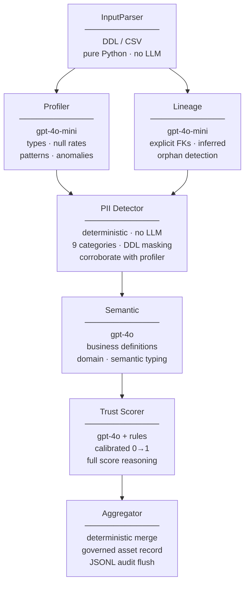
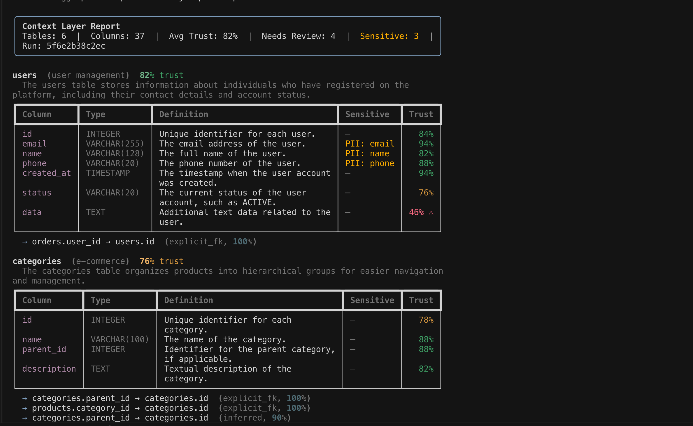

# Agentic Context Layer for Structured Data

> A multi-agent **LangGraph** pipeline that transforms raw database schemas into a **trustworthy context layer** — governed business definitions, semantic typing, data lineage, policy-enforced PII classification, and calibrated trust scores for every data asset.

Enterprise AI fails where data governance fails. This pipeline is an automated, auditable first pass at the work Atlan does at scale: enriching ungoverned data assets with the context, semantics, and trust signals that make them safe to reason over.

## The governance gap this solves

Modern data stacks accumulate hundreds of tables and thousands of columns with no business definitions, no ownership, and no documented lineage. When an AI assistant is asked "show me top customers by revenue", it has no way to know that `t_03.amt_v2` is the column it needs — and no way to know whether to trust that column's meaning even if it finds it.

The result is **ungoverned context**: AI that hallucinates answers because the underlying assets have no semantic anchoring, no lineage to explain where the data came from, and no trust signal to say whether the definition is reliable.

This pipeline produces that context layer automatically:

- **Business definitions** — human-readable descriptions of what every column and table means, grounded in profiled data patterns and cross-table relationships
- **Semantic typing** — inferred column types (`email`, `currency`, `timestamp`, `identifier`, `boolean`) that downstream AI agents can act on without guessing
- **Data lineage** — explicit foreign key relationships (confidence 1.0) plus inferred cross-table dependencies (confidence 0.5–0.9), with orphan table detection
- **Policy enforcement** — deterministic PII classification across 9 regulated categories, with DDL masking before any sensitive metadata reaches an LLM
- **Trust scores** — calibrated 0–1 confidence per definition, with a full score breakdown (rules + LLM reasoning) so every trust decision is explainable to data stewards
- **Governance health** — per-agent reliability signals (`ok` / `degraded` / `failed`) so consumers know which parts of the context layer to act on and which to treat with caution
- **Run-level observability** — every pipeline run produces a JSONL audit trail with per-agent latency, retry counts, prompt/response previews, and health status

**Wrong context is worse than no context.** Every output is scored. Anything below the trust threshold is flagged for human review rather than silently propagated.

## Pipeline at a glance



Each agent owns one governance concern. Each agent communicates via strictly typed Pydantic contracts. Each agent's output is independently inspectable and auditable.

## CLI output

Run the pipeline against any SQL DDL or CSV file and the Rich-rendered output surfaces every governance signal in the terminal:



The output includes:
- **Table summary** — name, definition, lineage relationships, and orphan status
- **Column-level asset records** — semantic type, trust score, PII flag, and review status for every column
- **Governance health** — per-agent `ok` / `degraded` / `failed` status
- **Run ID** — unique identifier linking this output to its full JSONL audit trail

## Key design decisions

These are intentional architectural choices, not implementation details.

### 1. LangGraph `StateGraph` — auditable, pausable orchestration

Every agent has a typed input/output contract via Pydantic. The graph state is a `TypedDict` where each agent writes to exactly one key — no shared mutable state, no merge conflicts during parallel execution. You can pause the graph after any node and inspect exactly what it produced. This is the foundation for an auditable governance pipeline: every enrichment decision has a clear owner and a clear output.

### 2. Parallel fan-out for Profiler and Lineage

They're independent governance concerns — data profiling and lineage inference have no data dependency on each other. Running them in the same LangGraph super-step halves wall-clock latency without adding orchestration complexity. The fan-in is automatic: LangGraph won't advance to the PII gate until both branches have written their results to state.

### 3. PII detection is a policy gate, not an LLM call

The PII Detector is the compliance boundary between raw schema data and the LLM layer. It uses **rule-based name matching corroborated by the profiler's semantic-type signals** to classify sensitive assets across 9 regulated categories: `email`, `phone`, `name`, `address`, `ssn`, `dob`, `financial`, `ip`, `credential`.

Confidence scoring:
- Name keyword match + profiler agreement = **1.0**
- Name keyword match alone = **0.85**
- Profiler signal only (no name match) = **0.7**

Three reasons this is deterministic, not LLM:
- **Auditability** — governance teams need to explain *why* a column was classified as sensitive. Rules produce a traceable classification decision.
- **Privacy** — sending column metadata to an LLM to ask "is this PII?" is itself a data governance violation. The policy gate exists to prevent exactly this.
- **Reliability** — PII categories are well-defined regulatory concepts. Pattern matching catches them with higher precision than probabilistic inference.

When a column is flagged, its DDL fragment is replaced with `[MASKED:<category>]` before the Semantic Agent sees it. The Semantic Agent produces a governance-safe definition based on the classification alone, with no speculation about actual values.

### 4. Hybrid trust scoring — governance-grade confidence

**Ungoverned definitions are worse than missing definitions.** The Trust Scorer combines two independent signals to produce calibrated, explainable confidence:

| Component             | Weight | Catches                                               | Weakness                              |
|-----------------------|:------:|-------------------------------------------------------|---------------------------------------|
| Deterministic rules   |  0.4   | Type-name mismatches, ambiguous names, high null rates | Can't evaluate semantic accuracy      |
| LLM assessment        |  0.6   | Wrong business domain, vague or contradictory definitions | Can hallucinate confidence         |

The deterministic component acts as a **governance floor**: if structural signals indicate a low-quality definition, no LLM confidence level can push the score above the `0.6` review threshold. Every score ships with a full human-readable breakdown:

```
Deterministic: 0.85 (flags: none) | LLM: 0.90 (definition is accurate and specific) | Final: 0.88
```

This makes trust explainable to data stewards and auditable by governance teams.

### 5. Strict Pydantic contracts — fail at the governance boundary

No raw `dict` crosses an agent boundary. If the LLM returns semantically malformed output, the failure surfaces at the Pydantic validation layer — not three agents downstream as a silent data quality error. Governance pipelines must fail loudly and early; silent errors propagate as trusted context.

### 6. Graceful degradation — reliability without false confidence

Every LLM-calling agent is wrapped in **bounded retries with exponential backoff** via a shared helper (`agents/_retry.py`). Hard caps prevent token burn and infinite loops:

- **3 attempts maximum** (1 initial + 2 retries) — a module-level constant, not configurable per call-site.
- **Non-retryable errors break immediately** — auth failures and context-length errors will never succeed on retry; continuing wastes tokens.
- **Exponential backoff** — 1s, then 2s — gives rate-limited APIs time to recover.

When retries are exhausted, each agent emits a **degraded but type-safe output** rather than crashing the pipeline:

| Agent | On failure | Governance impact |
|---|---|---|
| Profiler | Empty `ProfilerOutput` — downstream runs on structure alone | Definitions lose data-pattern grounding |
| Lineage | Explicit FKs preserved (deterministic); inferred lineage omitted | Lineage graph is incomplete, not wrong |
| Semantic | Empty definitions for every column | Trust Scorer floors all affected scores |
| Trust Scorer | All scores floored to 0.0, `needs_review=True`, `upstream_failure` flag | Human review required before use |

The Trust Scorer reads `agent_health` from upstream state. If Semantic failed, it skips its own LLM batch entirely — no point scoring empty definitions, and no reason to emit false-confident scores on ungoverned data.

Every run surfaces governance health in the final context layer:

```jsonc
"metadata": {
  "agent_health": {
    "profiler":      "ok",
    "lineage":       "ok",
    "semantic":      "ok",
    "trust_scorer":  "ok"
  }
}
```

### 7. Per-run audit trail — observability for every agent decision

Every pipeline run gets a `run_id`. Each agent logs a structured entry capturing what it did, how long it took, and whether it succeeded:

```jsonc
{
  "run_id": "a3f7c1b2e9d4",
  "agent": "semantic",
  "timestamp": "2026-05-06T14:32:01.123Z",
  "latency_ms": 2340.5,
  "attempts": 1,
  "health": "ok",
  "prompt_preview": "Generate definitions for:\n\n=== SCHEMA WITH PROFILES ...",
  "response_preview": "{\"tables\": [{\"table_name\": \"users\", ...}]}",
  "error": null
}
```

Entries are flushed as JSONL to `runs/{run_id}.jsonl`. The `run_id` is embedded in `ContextLayer.metadata` so consumers can retrieve the full trail via `GET /runs/{run_id}`.

This gives you:
- **Per-agent latency** — which agent is the bottleneck?
- **Retry visibility** — `attempts > 1` means the agent hit transient failures
- **Prompt/response previews** — debug what the LLM saw and what it returned without reading raw logs
- **Failure forensics** — `error` field captures the exception when an agent degraded

## Output: what a governed data asset looks like

### Column-level asset record

```jsonc
{
  "column_name": "email",
  "data_type": "VARCHAR(255)",
  "definition": "Contact email address for the registered user account.",
  "business_context": "Sensitive PII — used for transactional and marketing communication.",
  "semantic_type": "email",
  "is_sensitive": true,
  "pii_category": "email",
  "trust_score": 0.92,
  "needs_review": false,
  "trust_flags": []
}
```

### Table-level asset record

```jsonc
{
  "table_name": "orders",
  "definition": "Records each customer purchase transaction, including status and payment reference.",
  "domain": "e-commerce",
  "trust_score": 0.88,
  "needs_review": false,
  "relationships": [
    {
      "source_table": "orders",
      "source_column": "user_id",
      "target_table": "users",
      "target_column": "id",
      "relationship_type": "inferred",
      "confidence": 0.9
    }
  ],
  "columns": ["..."]
}
```

### Run metadata

```jsonc
{
  "generated_at": "2026-05-06T14:32:05Z",
  "schema_type": "sql",
  "table_count": 6,
  "column_count": 42,
  "average_trust": 0.84,
  "review_count": 3,
  "sensitive_column_count": 5,
  "run_id": "a3f7c1b2e9d4",
  "agent_health": {
    "profiler": "ok",
    "lineage": "ok",
    "pii_detector": "ok",
    "semantic": "ok",
    "trust_scorer": "ok"
  },
  "models_used": {
    "profiler": "gpt-4o-mini (fast)",
    "lineage": "gpt-4o-mini (fast)",
    "semantic": "gpt-4o (strong)",
    "trust_scorer": "gpt-4o (strong)"
  }
}
```

## Quick start

### Prerequisites
- Python 3.11+
- An OpenAI API key

### Install
```bash
git clone <repo-url> && cd agentic-data-context-layer
python -m venv .venv && source .venv/bin/activate
pip install -e ".[dev]"

cp .env.example .env       # add OPENAI_API_KEY
```

### Run via CLI

```bash
python -m context_layer samples/ecommerce.sql            # Rich-formatted output
python -m context_layer samples/ecommerce.sql --json     # raw JSON context layer
python -m context_layer samples/ecommerce.csv --type csv # CSV schema input
```

### Run via API

```bash
uvicorn context_layer.api:app --reload
```

```bash
# Governed context layer (JSON)
curl -X POST http://localhost:8000/analyze \
  -H "Content-Type: application/json" \
  -d '{"schema_text": "CREATE TABLE users (id INT PRIMARY KEY, email VARCHAR(255));", "schema_type": "sql"}'

# Rendered HTML governance report
curl -X POST http://localhost:8000/analyze/html \
  -H "Content-Type: application/json" \
  -d @- <<'EOF'
{"schema_text": "CREATE TABLE users (id INT PRIMARY KEY, email VARCHAR(255));", "schema_type": "sql"}
EOF

# List recent audit runs
curl http://localhost:8000/runs

# Retrieve full per-agent audit trail for a run
curl http://localhost:8000/runs/<run_id>

# Liveness check
curl http://localhost:8000/health
```

Auto-generated OpenAPI docs: `http://localhost:8000/docs`.

### Run tests (no live LLM calls)

```bash
pytest tests/ -v
```

Two test scenarios:
- **Happy path** — all agents succeed, full governed output verified end-to-end, audit trail has entries for all 7 agents, JSONL flushed.
- **Degraded path** — Semantic Agent fails all retries; asserts pipeline completes, Trust Scorer makes zero LLM calls, every definition is floored to 0.0 trust with `upstream_failure` flag, `agent_health["semantic"] == "failed"`, audit trail captures `attempts=3` and error for the semantic agent.

## Project structure

```
src/context_layer/
├── models/
│   ├── schema.py        # Input: TableSchema, ColumnSchema, ForeignKeyConstraint
│   ├── outputs.py       # All agent outputs + final ContextLayer + AgentHealth
│   └── state.py         # LangGraph PipelineState (TypedDict + agent_health reducer)
├── agents/
│   ├── _retry.py        # Bounded retry helper (MAX_RETRIES=2, non-retryable detection)
│   ├── input_parser.py  # DDL / CSV → structured schema (pure Python)
│   ├── profiler.py      # Data profiling: types, null rates, patterns, anomalies (gpt-4o-mini)
│   ├── lineage.py       # Data lineage: explicit FKs + inferred relationships (gpt-4o-mini)
│   ├── pii_detector.py  # Policy gate: 9-category PII classification + DDL masking
│   ├── semantic.py      # Business definitions + domain + semantic typing (gpt-4o)
│   ├── trust_scorer.py  # Trust calibration: rules × LLM + upstream-failure floor (gpt-4o)
│   └── aggregator.py    # Governed asset record assembly + audit trail flush
├── graph.py             # StateGraph wiring: parallel fan-out, PII gate, sequential tail
├── llm.py               # Tier-based LLM factory (fast = gpt-4o-mini, strong = gpt-4o)
├── run_logger.py        # Per-run JSONL audit trail (log, flush, read, list)
├── api.py               # FastAPI: /analyze, /analyze/html, /runs, /runs/{id}, /health
└── __main__.py          # Rich CLI

templates/report.html    # Jinja2 HTML governance report template
samples/                 # ecommerce.sql, ecommerce.csv — sample ungoverned schemas
runs/                    # JSONL audit trails per run (gitignored, created at runtime)
tests/                   # Mocked end-to-end tests: happy path + degraded governance
```

## Models used per agent

| Agent          | Model         | Why this tier                                                            |
|----------------|---------------|--------------------------------------------------------------------------|
| InputParser    | none          | Pure Python — DDL/CSV parsing needs no LLM inference                    |
| Profiler       | gpt-4o-mini   | Structured extraction; speed matters more than semantic depth            |
| Lineage        | gpt-4o-mini   | Name-pattern relationship inference; strong reasoning not required       |
| PII Detector   | none          | Policy enforcement demands deterministic, auditable classification rules |
| Semantic       | gpt-4o        | Business definition quality is the core governance deliverable           |
| Trust Scorer   | gpt-4o        | Calibrated trust assessment requires strong critical reasoning           |
| Aggregator     | none          | Deterministic merge — no LLM needed                                      |

Model identifiers are env-overridable via `FAST_MODEL` and `STRONG_MODEL` in `.env`.

## What this project demonstrates

- **Data governance pipeline** — automated enrichment of ungoverned schemas into trustworthy context assets, with a full audit trail per run
- **Semantic understanding at scale** — business definitions, semantic typing (9+ types), and domain classification without manual annotation
- **Data lineage inference** — two-pass design: deterministic FK extraction (confidence 1.0) plus LLM-inferred relationships (0.5–0.9), with orphan table detection
- **Policy-enforced privacy** — 9-category PII classification gate with profiler corroboration; sensitive DDL masked before reaching any LLM
- **Calibrated trust, not blind confidence** — hybrid rules × LLM scoring with a deterministic governance floor; every score has an explainable reasoning trail
- **Governance-aware reliability** — bounded retries, typed degraded fallbacks, upstream-failure flooring, `agent_health` in every response
- **Run-level observability** — per-agent JSONL audit trail with latency, retry counts, prompt/response previews; retrievable via `GET /runs/{run_id}`
- **LangGraph orchestration** — typed `TypedDict` state, parallel fan-out/fan-in, deterministic and LLM nodes interleaved, auditable at every step
- **Context layer as a service** — FastAPI with 5 endpoints, OpenAPI docs, Rich CLI, and a Jinja2 HTML governance report
